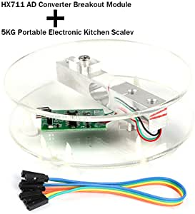
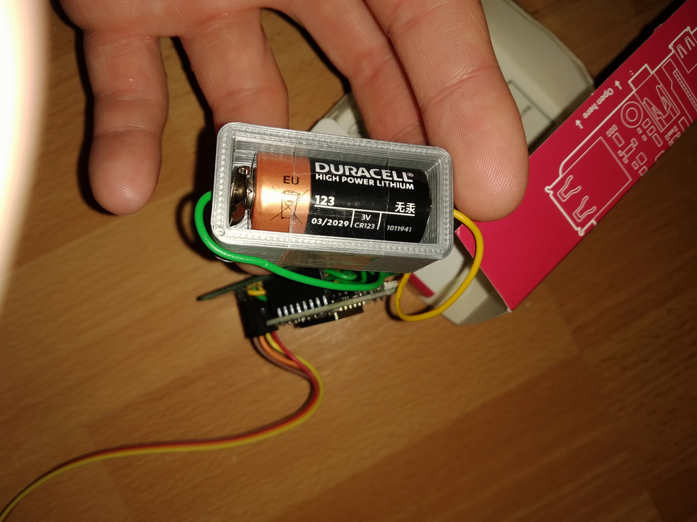
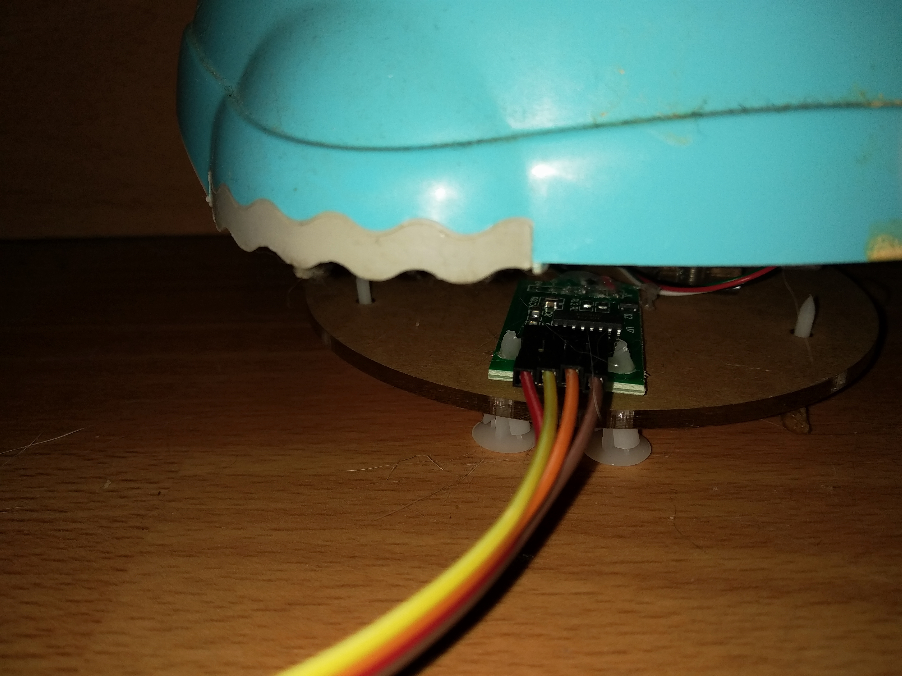

## Matériel

+ https://www.amazon.fr/gp/product/B07GRGT3C3/ref=ppx_yo_dt_b_asin_title_o00_s00?ie=UTF8&psc=1

+ https://www.amazon.fr/AZDelivery-D1-Mini-d%C3%A9veloppement-compatible/dp/B0754W6Z2F/ref=sr_1_5?__mk_fr_FR=%C3%85M%C3%85%C5%BD%C3%95%C3%91&keywords=d1+mini&qid=1581578264&s=computers&sr=1-5

## Lib

+ https://github.com/bogde/HX711
+ https://github.com/knolleary/pubsubclient

## Analyse

+ http://riton-duino.blogspot.com/2019/02/alimenter-un-arduino-sur-pile-ou.html
+ https://www.radioshuttle.de/fr/medias-fr/informations-techniques/esp32-alimente-par-batterie/
+ https://blog.voneicken.com/2018/lp-wifi-esp8266-1/

## Modele 3D pile

https://www.thingiverse.com/thing:487437

## Montage 

